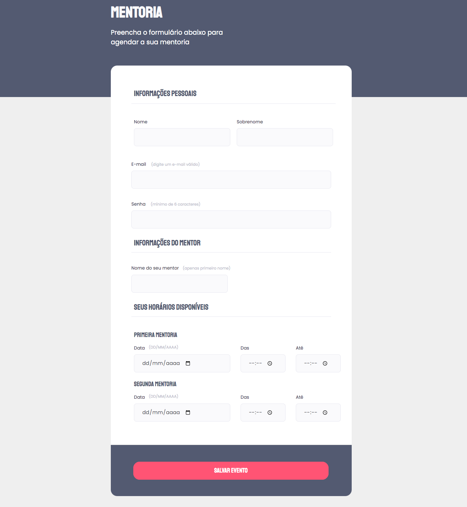

# Formulário intermediário

## Trilha Explorer 🚀
Acesse o link do projeto em <strong>
About

💜 Desafio do Stage 03 - Formulário intermediário

## 🔰 Tecnologias

- HTML
- CSS
- Git e Github

## 📚 Meu aprendizado

Através da aulas do Stage 03 adquiri maiores e fascinantes conhecimentos sobre o HTML e CSS.
Com uma didática leve e objetiva conheci brevemente sobre o Git e Github.

## 🤸‍♀️ Contato

https://www.linkedin.com/in/palomabecker/

e-mail: palomabeckers@hotmail.com